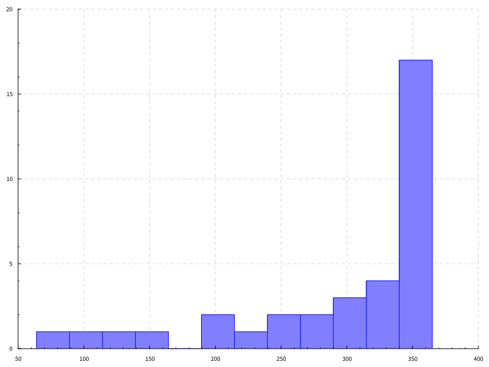
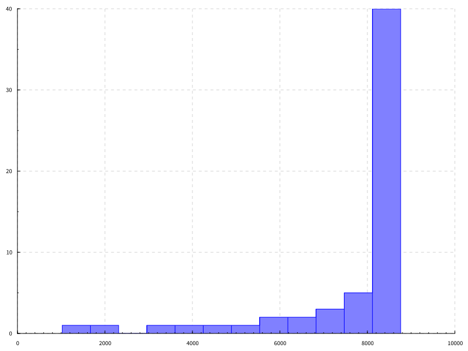
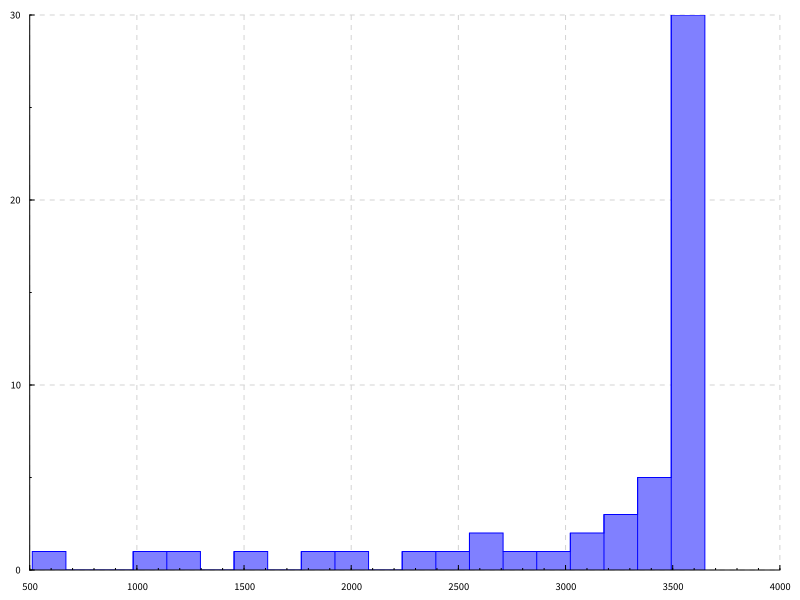
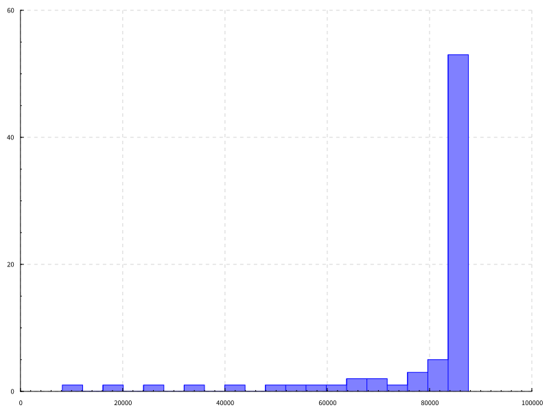
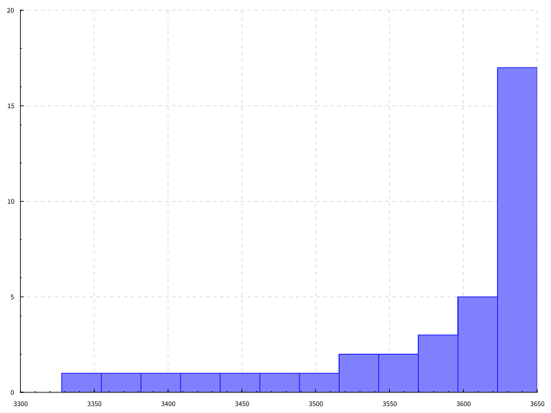
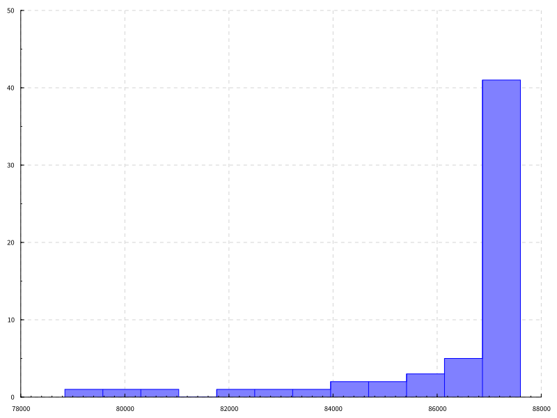
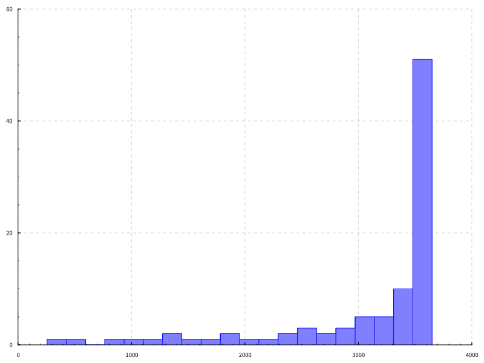

Zlogshot
---

Zlogshot replicates a ZFS dataset, and maintains `O(log(n))` backups,
where `n` is the total number of backups ever taken (probably; see
below). Backup rotations are scheduled by generation rather than by
calendar so that turning on your computer for the first time in 2
months doesn't delete 2 month's worth of backups for no reason.

The logarithmic distribution of backups allows good flexibility in the
creation of new backups. You can make quick bursts of many backups at
will, and they'll still be weeded out very efficiently, without
modifying the algorithm or deleting significant amounts of
history. This only applies within reason. If you've been taking one
backup a day for one year, then suddenly taking 365 new backups at
once will destroy most of your history. It's best to keep a reasonably
consistent average rate, but modest fluctuation is generally harmless.

Usage
---

First, setup your destination.

```bash
$ zlogshot-setup zroot/source backup-pool/destination
```

Now, you can periodically create new backups.

```bash
$ zlogshot-create zroot/source backup-pool/destination
```

You have to prune the destination of expired backups manually. This is
so whenever SSH destinations are implemented, the server can prune
itself and appear append-only to the client.

```bash
$ zlogshot-prune backup-pool/destination
```

You can also have multiple backup destinations, if you set a
label. The label can be changed at will, as the destination merely
records the full name of the most recent snapshot, and puts the label
in the new name. A different label is needed for each destination only
so each daemon doesn't try to create local snapshots of the same name
at the same time. The label must be supplied on the command line for
each creation, as the system is relatively stateless.

```bash
zlogshot-setup -l secondary-backup zroot/source secondary-backup-pool/data-backup
zlogshot-create -l secondary-backup zroot/source secondary-backup-pool/data-backup
```

There is a parameter, called the coefficient (a better name would be
appreciated), which affects the lifetime of the backup being
created. The higher, the longer. Default is 10. 1 is dangerous, and
should be avoided.

```bash
zlogshot-create -k 20 zroot/source backup-pool/destination
```

How It Works
---

It's based on this function:

```haskell
lifetimeOf :: Integer -> Integer -> Integer
lifetimeOf k n = if x == n then k * n else lifetimeOf k (n - x)
  where x = 2 ^ (floor (logBase 2 (fromIntegral n) :: Double) :: Integer)
```

This function takes two arguments: a multiplier `k`, and a generation
number `n`. Every new backup will be assigned a generation number one
greater than the previous backup. It will also be assigned its
expiration generation, `n + lifetimeOf k n`. When a new backup is
created, all previous backups with an expiration generation equal to
the new backup's generation should be deleted.

The `lifetimeOf` function probably looks a bit more complicated than
it is. It simply finds the largest power of 2 less than or equal to
`n` that also divides `n`, and multiplies it by `k`. To understand why
this works, imagine the simplest case, where `k = 1`.

```
ghci> lifetimeOf 1 <$> [1..64]
[1,2,1,4,1,2,1,8,1,2,1,4,1,2,1,16,1,2,1,4,1,2,1,8,1,2,1,4,1,2,1,32,1,2,1,4,1,2,1,8,1,2,1,4,1,2,1,16,1,2,1,4,1,2,1,8,1,2,1,4,1,2,1,64]
```

There's a pattern. First of all, `lifetimeOf 1 (2 ^ n) == 2 ^ n`
because `2 ^ n` is obviously the greatest power of two that divides `2
^ n`. Secondly, the pattern of numbers in the range `(2 ^ n, 2 ^ (n +
1))` is always the same as the pattern of numbers in `[1, 2 ^
n)`. I.E. the pattern of numbers after a power of two is identical to
the pattern before it, up until the next power of 2 (immediately after
that pattern should end anyway). With `1` and `2` as a base case, you
can extend this pattern infinitely. Between `2` and `4` should be `1`,
and between `4` and `8` should be `1, 2, 1`.

It starts to look like a self-similar fractal as you zoom out. This
self-similarity is why I believe this is logarithmic, though I haven't
proven this yet. I have another reason below that reinforces this
belief.

The problem with `k = 1` is that for all `n`, by generation `2 ^ n`,
every generation less than `2 ^ n` will be destroyed. So at every
power of two, you lose everything. Turns out this is pretty nicely
solved by simply multiplying the numbers by a larger constant like 10.

I've included a couple functions for generating graphs of the number
of backups remaining currently from different periods of
history. Here's the number of backups from each month with `k = 10` if
you take one daily for a year.

```
ghci> writeSvg' 12 10 365
35
```

*`writeSvg'` returns the number of backups total remaining.*



---

And here's if you take one every hour instead.

```
ghci> writeSvg' 12 10 (365 * 24)
58
```



---

The number of backups from each 6 month period after taking daily
backups for 10 years.

```
ghci> writeSvg' 20 10 (10 * 365)
52
```



---

10 years of hourly backups.

```
ghci> writeSvg' 20 10 (10 * 365 * 24)
75
```



---

Hourly and daily are fairly comparable, with the exception that there
are a lot more very recent snapshots with the hourly one. Here's only
the latest year of each.

*Daily*

```
ghci> writeSvg (filter (> 9 * 365) $ survivingGens 10 (10 * 365)) 12
36
```



*Hourly*

```
ghci> writeSvg (filter (> 9 * 365 * 24) $ survivingGens 10 (10 * 365 * 24)) 12
59
```



Unsurprisingly, taking the last year of a decade long history is
nearly identical to the entirety of a year long history.

---

Finally, here's what happens if you try 10 years of daily backups with
`k = 20`.

```
ghci> writeSvg' 20 20 (10 * 365)
94
```



As you can see, you get significantly more backups in the most recent
4 years, and noticably more in the past behind that.

---

Similarity to `log2rotate`
---

Zlogshot is very similar to
[log2rotate](http://jekor.com/log2rotate/), which operates somewhat
differently. Rather than setting an expiration for each backup, it
effectively looks at the most recent generation number and prints out
a list of backups that should have been deleted by that generation
number. This is completely stateless, which is nice, but it does mean
that the algorithm can never be tuned, because then the new version
would disagree with the old version, and likely end up recommending
you delete almost all of your backups.

Zlogshot, on the other hand, records the expiration of a backup within
the backup metadata, so new generations created with different
parameters will have no effect on the lifetimes of old
generations. The other nice thing about simply recording expirations
is that lifetimes can be modified ad-hoc on any living generations.

Operationally, `log2rotate` uses a similar algorithm to Zlogshot's,
except that it's based on starting at gen 0 and calculating the space
between it and the next generation that should live. This is very
different than calculating the generation's lifetime, which for a
living generation should be farther in the future than the current
generation. After calculating the space to the next live one, it
repeats this process for the next one, exponentially increasing the
rate at which the space between generations decreases.

It's fairly easy to prove that the algorithm in `log2rotate` produces
`O(log(n))` backups. I haven't proven yet that Zlogshot has the same
property, though I strongly suspect it does, both because of the
fractal pattern mentioned above, and because you can effectively
define `log2rotate` in terms of `lifetimeOf`. You can twist the output
of `log2rotate` to instead return the lifetime of each
generation. When you do, you find that it produces the exact same list
of lifetimes as this function:

```haskell
log2rotateLifetime :: Integer -> Integer
log2rotateLifetime n = lifetimeOf 3 n - 1
```

I haven't proven that this is *definitely* equal to `log2rotate`, but
I've tested it up to `n == 20000`, and haven't found any
mismatches. This strongly suggests Zlogshot is also `0(log(n))`.
